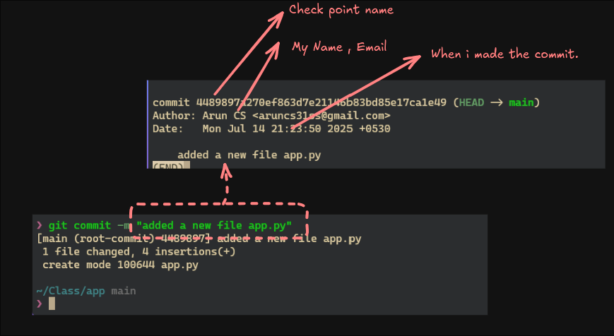

# Level 5 


Task: To configure `git` properly , and explore additional usage of `git log`.
## Lets recap 
Up until you have seen the following commands 
```bash
git status # to check the status of the repo 
git log # to see the commit history
git add # to add files to the staging area
git commit # to commit the staged files
git log # to see the commit history
git branch # to see the branches
git checkout # to switch branches
```
And you will need to use most of them inorder to complete this level. 
### Configuring Git
Let's start by properly configuring `git`. I have already explained `git log` in [[Level 3]] of this course. And you may remember the following, a single log entry may look like this. 



You can see that , there are a few details like 
- Your name 
- Your email
- The commit message
- The date and time of the commit etc. 
But have you ever thought from where did the `git` obtains this information?.
if you type the following:
```bash
git config --get user.name
```
you will obtain the following
```
Arun CS
```
and to get the `email` run the following.
```bash 
git config --get user.email
```

```
aruncs31ss@gmail.com
```

I was able to get this because i configured it , when i installed `git`. 
In order to configure things like `name` and `email` , run the following

```bash
git config user.name "Arun CS"
```
For example if you want to change you name to something like "Dog", you can run the following command:
```bash
git config user.name "Dog"
```


This type of configuration is called `local` or `project` or `repo` level configuration. What i mean by that is that , look at the following example, 


when i run 
```bash
git config --get user.name
```
it prints `Dog` , but when i change repo , or directory the name also changes. 
To make the changes `global` you should use the `--global` flag like this,

```bash
git config --global user.name "Arun CS"
```

>[!tip]
> you can also get the `global` configuration like the following
> 

So there are 2 types of configuration , and the are `global` and `local` and stored in `~/.gitconfig` and `.git/config` respectively.

>[!tip]- on Linux
>you can check the global config by running the following 
>```bash
>cat ~/.gitconfig
>```
>>[!success]- **output**
>>```ini
>>[user]
>>name = Arun CS
>>mail = aruncs31ss@gmail.com
>>email = aruncs31ss@gmail.com
>>[http]
>>postBuffer = 524288000
>>```
>and `local` by 
>```bash
>cat .git/config
>```
>>[!success]- **output**
>>```ini
>>[core]
>>repositoryformatversion = 0
>>filemode = true
>>bare = false
>>logallrefupdates = true
>>ignorecase = true
>>precomposeunicode = true
>>[remote "origin"]
>>url = https://github.com/aruncs31s/git_by_doing_level_5
>>fetch = +refs/heads/*:refs/remotes/origin/*
>>
>>[branch "main"]
>>remote = origin
>>merge = refs/heads/main
>>[user]
>> name = Dog
>>```

- [ ] check this is true if not modify it.  🏁 delete 
**FAQ: Where these name and mail id used**
- Others can easily verify who made the commit.
- And it is required for features like `git blame`, which shows who last modified each line of a file.


## Where these will be used?
You have already learned about `git commit` and `git log` in [[Level 3]] , right?. So when you do a `git log` you see see the following right?
- Your name 
- Your email
- The commit message 

We can use this `git log` and `git blame` to identify who made some specific 
For example you can check if someone named `zeidan` had made any commit , and what they have changed , for the time beeing we will not focus on `git blame` it will be coverd in another level
- [ ] mention in which level the `git blame` is covered. 🏁 delete  

```bash
git log --author=zeidan
```

There is only single commit becouse , zeidan has done only one commit , and if you also want what he have changed you can include the `-p` flag 
```bash
git log --author=zeidan -p
```


So you get a lot of infomation from using `git log` and with the `-p` flag.

> [!Tip]
> When you check out a commit , you will see the history of commit upto you commit only. dont get it? 
> Take a look at the following example
>
> Where i have 4 comits , `commit 1` , `commit 2`, `commit 3` and `commit 4`.  and when i checkout `commit 3` i will no longer se `commit 4` in the log.

